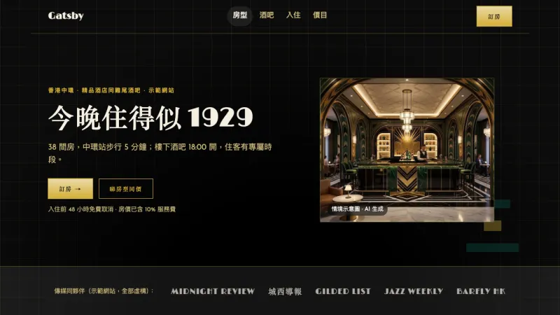
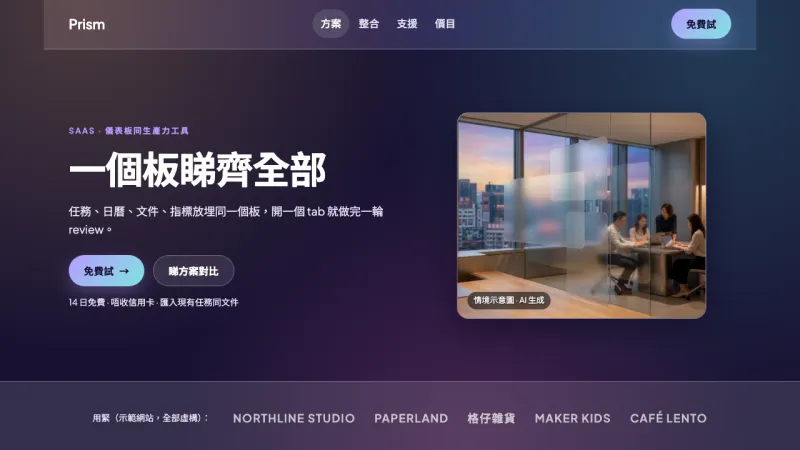
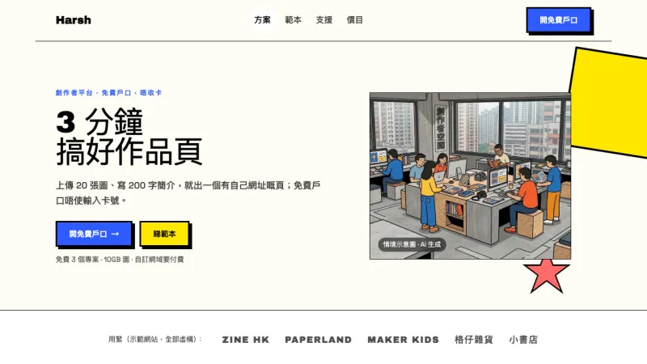
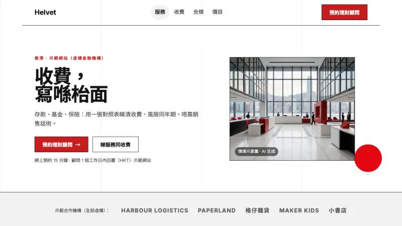
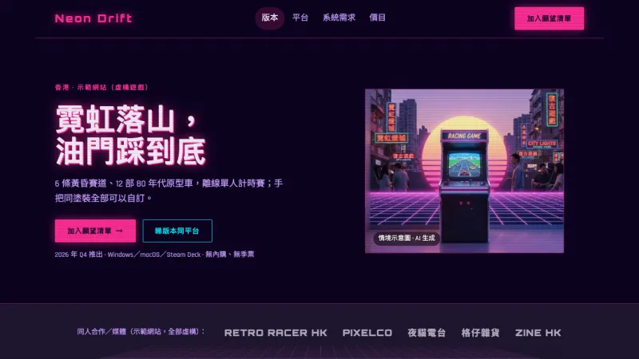
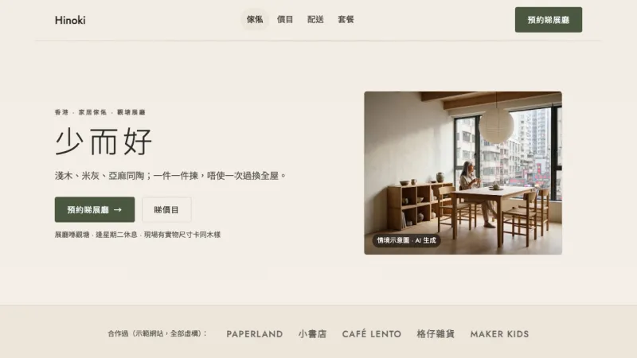
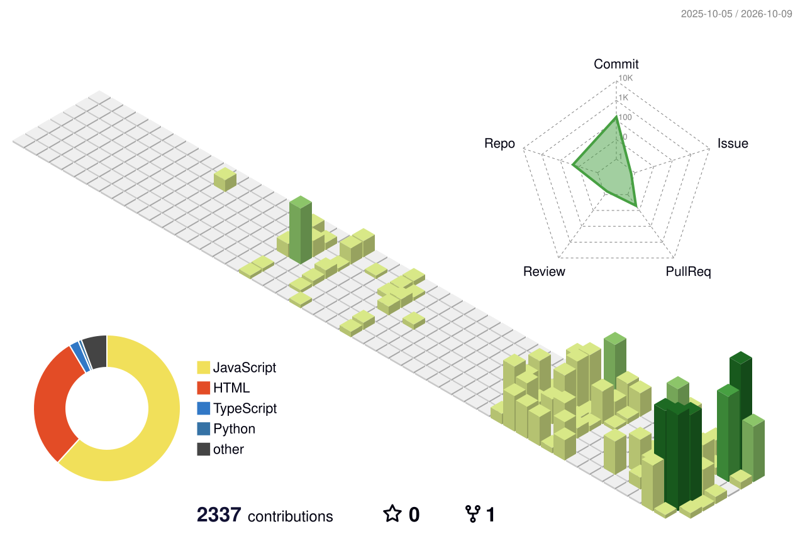

<picture>
  <source media="(prefers-color-scheme: dark)" srcset="assets/header-dark.svg">
  
</picture>

## Now building

**An AI teaching platform for schools.** It helps teachers mark, prepare lessons and follow up on each student, while teachers make the final call.

`Django` `Celery` `PostgreSQL` `Next.js` `React` `LLMs` `OCR`

## Style gallery

One landing page, rebuilt in 57 design styles. Each one is a full set of design tokens, not just a colour swap. Click any of them to open the live demo.

<table>
  <tr>
    <td width="33%" align="center"> <b>Art Deco</b></td>
    <td width="33%" align="center"> <b>Glassmorphism</b></td>
    <td width="33%" align="center"> <b>Neo-Brutalism</b></td>
  </tr>
  <tr>
    <td width="33%" align="center"> <b>Swiss Design</b></td>
    <td width="33%" align="center"> <b>Synthwave</b></td>
    <td width="33%" align="center"> <b>Japandi</b></td>
  </tr>
</table>

<a href="https://kelvin0611.github.io/uiux-style-demos/"><b>See all 57 styles →</b></a>

## Open work

| Project | What it is | Live |
|:--|:--|:--|
| **[UI Kit](https://github.com/kelvin0611/ui-kit)** | A one-file CSS token system for colour, type and motion | [Demo](https://kelvin0611.github.io/ui-kit/) |
| **[Transit Arrivals](https://github.com/kelvin0611/c0713a-demo)** | A front-end app that shows transport arrival times from open data | [Demo](https://kelvin0611.github.io/c0713a-demo/) |
| **[Car Renting System](https://github.com/kelvin0611/Car-Renting-Management-System-CRMS)** | Peer-to-peer car rental with renter, owner and admin dashboards. Flask + MySQL | |

## Stack

  

## Activity

<picture>
  <source media="(prefers-color-scheme: dark)" srcset="profile-3d-contrib/profile-night-green.svg">
  
</picture>

<picture>
  <source media="(prefers-color-scheme: dark)" srcset="https://raw.githubusercontent.com/kelvin0611/kelvin0611/output/pacman-contribution-graph-dark.svg">
  
</picture>
